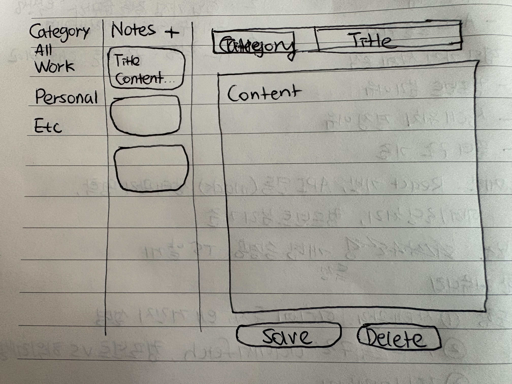

# 프로젝트 설계

## 주요 기능

- 노트 목록 렌더링
- 노트 추가/수정/삭제
- 카테고리 필터링



## 데이터 및 이벤트 흐름

1. 앱 실행 → notes fetch(useEffect) → NoteList 렌더링
2. 노트 수정:
   1. NoteList 클릭(onSelect) → selectedNoteId 업데이트 → draftNote(props) 업데이트 → NoteEditor 렌더링
   2. NoteEditor 수정(onChange) → draftNote 업데이트 → NoteEditor 리렌더링
   3. NodeEditor 저장(onSave) → notes 업데이트 → NoteList 리렌더링 → draftNote 초기화
3. 노트 추가:
   1. 추가 버튼 클릭(onAdd) → draftNote 업데이트 (빈 노트 생성) → NoteEditor 리렌더링
   2. NoteEditor 수정(onChangeDraft) → draftNote 업데이트 → NoteEditor 리렌더링
   3. NodeEditor 저장(onSave) → notes 업데이트 → NoteList 리렌더링 → draftNote 초기화 리렌더링
4. 노트 삭제:
   1. NoteList 클릭(onSelect) → selectedNoteId 업데이트 → draftNote(props) 업데이트 → NoteEditor 렌더링
   2. 삭제 버튼 클릭(onDelete) → notes 업데이트 (해당 노트 삭제) → NoteList 리렌더링
   3. selectedNoteId 업데이트 (null) → draftNote(props) 업데이트 (null) → NoteEditor 언마운트
5. 카테고리 필터링:
   1. CategoryFilter 클릭(onChangeCategory) → selectedCategory 업데이트 → NoteList/CategoryFilter 리렌더링

### 필요한 상태

- notes
- selectedNoteId
- draftNote
- selectedCategory

### 필요한 컴포넌트

- NotesPage
  - state: notes, selectedNoteId, draftNote, selectedCategory
- NoteList: 목록 표시 + 선택 이벤트 전달
  - props: notes, selectedNoteId, onSelect, selectedCategory
- NodeEditor: 노트 생성/수정 UI + 저장 트리거
  - props: draftNote, onChangeDraft, onSave, onDelete
- CategoryFilter: 필터 상태 변경 트리거
  - props: categories, selectedCategory, onChangeCategory

### 컴포넌트 구조

```markdown
App
├─ NotesPage
│ ├─ NoteList
│ ├─ NoteEditor
│ └─ CategoryFilter
```

## API

- getNotes
- updateNotes
- createNotes
- deleteNotes

## 폴더 구조

```markdown
/components
NoteList.jsx
NoteEditor.jsx
CategoryFilter.jsx

/pages
NotesPage.jsx

/api
notes.js

/hooks (선택)

/docs
```

## 기타

- 로딩/에러 처리
- AI 활용
